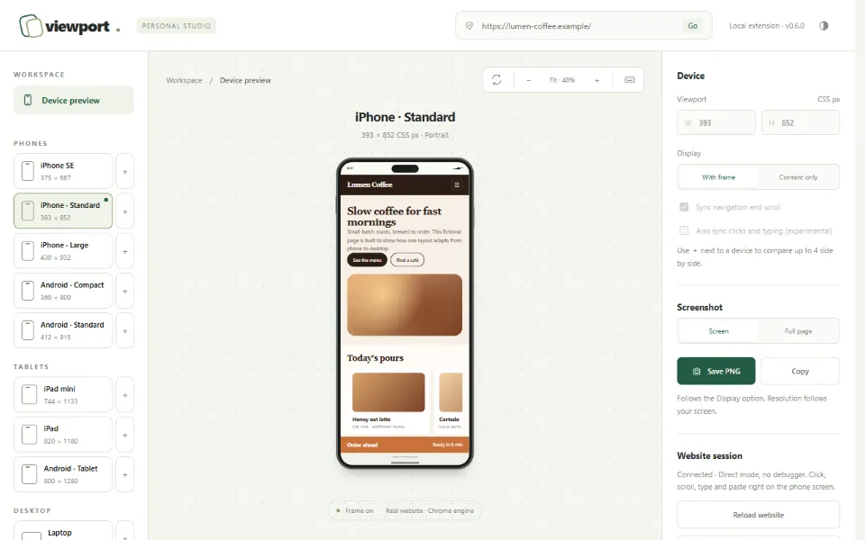
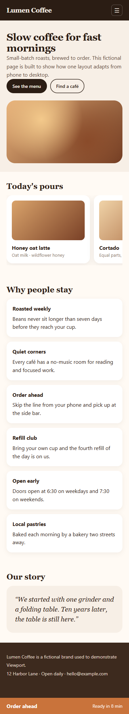

# Viewport — Mobile Preview Studio

Extension Chrome gratis dan open source untuk melihat website dalam ukuran HP di dalam bingkai perangkat. Semuanya berjalan langsung di tab browser, tanpa aplikasi terpisah, akun, server, atau paket berbayar.

[English](README.md)



- **Tanpa banner debugger.** Website dimuat di iframe asli, jadi Chrome tidak menampilkan "started debugging this browser".
- **Satu tab.** Ikon di toolbar mengubah tab yang sedang dibuka menjadi studio dan mengembalikannya lagi. Tidak ada tab tambahan atau jendela popup.
- **Interaksi asli.** Klik, scroll, ketik, paste, IME, file picker, dan tombol Back berjalan langsung di layar HP.
- **Ganti ukuran instan.** Ganti preset, pakai ukuran custom, dan rotasi tanpa reload.
- **Bandingkan berdampingan.** Hingga 4 perangkat sekaligus. Navigasi dan scroll ikut sinkron, termasuk carousel dan area scroll di dalam halaman. Lepas satu device dari sinkron agar tetap di halamannya sendiri.
- **Screenshot.** Simpan PNG atau salin ke clipboard, dengan atau tanpa bingkai. **Halaman penuh** menangkap halaman dari atas sampai bawah; header yang menempel dan bar fixed hanya muncul sekali.
- **Rekam video.** Rekam device ke MP4 (atau WebM kalau MP4 tidak tersedia) untuk laporan bug. Chrome meminta izin berbagi tab setiap kali, dan videonya dipotong ke device.
- **Daftar device.** Sepuluh preset HP, tablet, dan desktop, plus ukuran custom yang bisa diberi nama dan disimpan.
- **Zoom.** Muat semua di layar (fit) atau tampilkan ukuran asli (100%).
- **Seret untuk scroll.** Drag mouse menggeser halaman atau carousel seperti jari, meluncur saat dilepas, dan tidak pernah mengklik tempat awal drag. Kolom form tetap berperilaku mouse biasa.
- **User agent mobile.** Ganti Studio antara Desktop, iPhone, dan Android. Server dan script halaman sama-sama melihat browser HP.
- **Shortcut keyboard.** Tekan `?` di studio untuk melihat daftarnya. `Alt+Shift+V` membuka atau menutup Viewport dari tab mana pun.
- **Tema gelap.** Mengikuti sistem, atau pilih terang/gelap lewat tombol di header.
- **Sinkron klik dan ketikan (eksperimental).** Isi form atau buka menu sekali, device lain ikut.
- **Privat.** Tidak ada koneksi jaringan, analytics, kode jarak jauh, atau build step.

## Tangkapan layar

| Studio dengan tiga device | Screenshot halaman penuh (HP) |
|---|---|
|  |  |

## Pasang

1. Clone atau unduh repo ini.
2. Buka `chrome://extensions`, lalu aktifkan **Developer mode**.
3. Klik **Load unpacked** dan pilih folder `extension`.

Butuh Chrome 128 atau lebih baru. Browser berbasis Chromium seperti Edge juga seharusnya jalan.

## Pakai

1. Buka website atau halaman `localhost` yang ingin diuji, lalu klik ikon Viewport.
2. Saat pertama kali, klik **Izinkan akses website** dan setujui dialog Chrome. Izin ini cukup diberikan sekali.
3. Ketik alamat lain di kolom alamat studio, atau navigasi langsung di dalam HP.
4. Klik device di daftar untuk mengganti device yang dipilih, atau klik **＋** di sebelahnya untuk menambahkannya berdampingan. Klik nama device di atas HP untuk memilihnya, **×** untuk menghapusnya, atau ikon tautan untuk melepasnya dari sinkron.
5. Ketik lebar dan tinggi untuk membuat ukuran custom, lalu beri nama agar tersimpan di **Tersimpan**.
6. Klik ikon lagi, tekan `Alt+Shift+V`, atau pakai **Keluar dari Viewport** untuk mengembalikan tab ke halaman terakhir.

## Cara kerja

Sebagian besar website menolak ditampilkan di iframe (`X-Frame-Options`, CSP `frame-ancestors`). Viewport memakai aturan sesi `declarativeNetRequest` untuk menghapus header tersebut **hanya pada sub-frame di dalam tab studio**. Tab lain tetap mendapat proteksi framing dari situsnya. Aturan ini dihapus saat keluar dari studio, pindah alamat, atau tab ditutup. CSP hanya dihapus jika isinya mengandung `frame-ancestors`.

Content script kecil (`frame.js`) hanya aktif jika induk langsungnya adalah studio (dicek lewat `location.ancestorOrigins`). Script ini menyembunyikan scrollbar desktop agar lebar layout tidak berkurang sekitar 15px. Script ini juga melaporkan URL halaman, dan posisi scroll saat sinkron aktif, ke studio lewat port extension yang tidak bisa dipalsukan halaman web. Di halaman lain, script ini langsung berhenti.

Penjelasan tiap izin ada di [README.md](README.md#how-it-works).

## Batasan

- Hanya ukuran viewport CSS dan, kalau dipilih, user agent yang sama dengan perangkat. DPR, event sentuh, dan media query `hover`/`pointer` tetap bernilai desktop, dan preset iPhone tetap dirender mesin Chrome, bukan Safari.
- User agent berlaku untuk semua device di tab Studio, karena aturan request Chrome tidak bisa menargetkan satu frame saja. Preset iPad memakai agent desktop, sama seperti Safari di iPadOS. Web worker tetap memakai agent desktop.
- Halaman tanpa meta viewport dirender selebar perangkat, bukan layout 980px yang di-zoom seperti di browser HP.
- Di dalam preview, CSP situs diabaikan jika berisi `frame-ancestors`. Masalah yang berkaitan dengan CSP perlu diuji di tab biasa.
- Chrome memblokir alamat `http://` non-localhost (misalnya `http://192.168.x.x`) sebagai mixed content. Gunakan `localhost`, `127.0.0.1`, atau https.
- Framebuster yang dijalankan setelah klik pengguna bisa mengambil alih tab.
- Selama merekam, device memenuhi jendela supaya videonya tajam, dan bar mengambang menampilkan jam serta tombol **Berhenti**. Rekaman tidak menyertakan pointer mouse dan berhenti sendiri setelah lima menit.
- Resolusi screenshot bergantung pada layar. Perangkat ditampilkan sendirian sesaat dalam ukuran terbesar yang muat di jendela, dan tab Viewport harus tetap di depan sampai screenshot selesai.
- Screenshot halaman penuh men-scroll halaman satu layar demi satu layar (sekitar 0,6 detik per layar). Animasi yang muncul saat scroll bisa terlihat berbeda, dan halaman yang sangat panjang dipotong di 32.000 piksel gambar.
- Sinkron klik dan ketikan memutar ulang aksi berdasarkan posisi elemen di halaman, sama seperti sinkron scroll di dalam halaman. Link diserahkan ke sinkron navigasi, dan kolom password maupun file tidak pernah disalin. Klik yang diputar ulang mencakup tekanan penuh (pointer dan mouse down/up), tetapi drag, hover, dan tekan lama tidak diputar ulang.
- Area scroll di dalam halaman dicocokkan antar-device berdasarkan posisinya di struktur halaman. Kalau markup-nya berbeda per ukuran layar, area itu tidak ikut sinkron. Navigasi yang disinkronkan memuat ulang halaman di perangkat lain, termasuk perpindahan route di single-page app.

Rencana fitur ada di [ROADMAP.md](ROADMAP.md).

## Pengembangan

Tidak ada build step, dan extension-nya tanpa dependency. Pemeriksaan butuh Node.js 22 atau lebih baru; hanya tes browser yang memasang Playwright (`npm install`, `npx playwright install chromium`, lalu `npm run e2e`).

```bash
npm test
```

```bash
npm run check
```

Kontribusi, laporan bug, dan pull request dipersilakan. Baca [CONTRIBUTING.md](CONTRIBUTING.md). Lisensi: [MIT](LICENSE).
