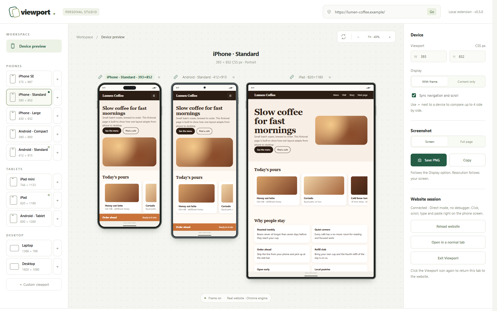

# Viewport — Mobile Preview Studio

A free, open-source Chrome extension for previewing websites at phone sizes inside a device frame. It works right in your browser tab, without a separate app, account, server or paid plan.

[Bahasa Indonesia](README.id.md)



- **No debugger banner.** The site loads in a real iframe, so Chrome does not show "started debugging this browser".
- **One tab.** The toolbar icon turns the current tab into the studio and back again. It does not open extra tabs or popup windows.
- **Real interaction.** Click, scroll, type, paste, use IME, file pickers and the Back button directly on the phone screen.
- **Instant resize.** Switch presets, set custom sizes and rotate without reloading the page.
- **Side-by-side comparison.** Show up to 4 devices at once. Navigation and scrolling stay in sync, including carousels and other inner scroll areas. Unlink a device to keep it on its own page.
- **Screenshots.** Save a PNG or copy it to the clipboard, with or without the device frame. **Full page** captures the whole page from top to bottom and shows sticky headers and fixed bars only once.
- **Device library.** Ten phone, tablet and desktop presets, plus custom sizes you name and keep.
- **Zoom.** Fit everything on screen, or view devices at true size (100%).
- **Private by design.** No network calls, analytics, remote code or build step.

## Install

1. Clone or download this repository.
2. Open `chrome://extensions` and turn on **Developer mode**.
3. Click **Load unpacked** and select the `extension` folder.

Requires Chrome 128 or newer. Chromium-based browsers such as Edge should also work.

## Use

1. Open the website or `localhost` page you want to test, then click the Viewport icon.
2. The first time, click **Allow website access** and approve Chrome's dialog. You only need to do this once.
3. Type other addresses in the studio's address bar, or navigate inside the phone.
4. Click a device in the list to switch the selected device, or click **＋** next to it to add it alongside. Click a device's name above it to select it, **×** to remove it, or the link icon to take it out of sync.
5. Type a width and height to make a custom size, then name it to save it under **Saved**.
6. Click the icon again, or **Exit Viewport**, to return the tab to the last page you visited.

## How it works

Most websites refuse to be shown inside an iframe (`X-Frame-Options`, CSP `frame-ancestors`). Viewport uses [`declarativeNetRequest`](https://developer.chrome.com/docs/extensions/reference/api/declarativeNetRequest) session rules to remove those headers **only for sub-frames inside the studio tab**. Other tabs keep every site's framing protection. Viewport removes the rules when you leave the studio, navigate the tab elsewhere or close it. It removes CSP only when the policy contains `frame-ancestors`.

A small content script (`frame.js`) runs only when its direct parent is the studio (checked through `location.ancestorOrigins`). It hides desktop scrollbars, which would otherwise take about 15px of layout width. It also reports the page URL, and the scroll position while sync is on, to the studio over an extension port that the web page cannot forge. It exits immediately on every other page.

| Permission | Why |
|---|---|
| `activeTab` | Read the URL of the tab where you clicked the icon. |
| `storage` | Keep the current page for the browser session, and your devices, layout and saved sizes across restarts. |
| `scripting` | Register `frame.js` (http and https pages only). |
| `declarativeNetRequestWithHostAccess` | Apply the studio-only framing rules. |
| `<all_urls>` (optional) | Requested once from the studio. It covers framing, login cookies inside the frame, `frame.js` and screenshots (`captureVisibleTab` requires `<all_urls>`). |

## Limitations

- Only the CSS viewport size matches the device. Device pixel ratio, touch events, `navigator.userAgent` and the `hover`/`pointer` media features stay desktop values. iPhone presets still use Chrome's engine, not Safari.
- Pages without a viewport meta tag render at device width instead of the zoomed-out 980px layout that mobile browsers use.
- Inside the preview, Viewport ignores a site's CSP when that CSP contains `frame-ancestors`. Test CSP-related issues in a normal tab.
- Chrome blocks plain `http://` addresses other than localhost (such as `http://192.168.x.x`) as mixed content. Use `localhost`, `127.0.0.1` or https.
- A framebusting script that runs after a user click can take over the tab.
- Screenshot resolution depends on your screen. Devices are briefly shown alone at the largest size that fits the window, and the Viewport tab must stay in front until the screenshot is done.
- Full-page screenshots scroll the page one screen at a time (about 0.6 seconds per screen). Animations that play on scroll can look different from a normal visit, and extremely long pages are cut at 32,000 image pixels.
- Inner scroll areas are matched between devices by their position in the page. If a layout builds different markup per screen size, that area is not synced. A synced navigation fully loads the page in the other devices, including single-page-app route changes.

See [ROADMAP.md](ROADMAP.md) for planned features.

## Development

There is no build step and there are no dependencies. You need Node.js 22 or newer to run the checks.

```bash
npm test
```

```bash
npm run check
```

The tests cover URL and size validation, session ownership, rule scoping and cleanup, the `frame.js` gate, scroll sync and full-page strips, layout math, stored-preference cleanup, and translation coverage, all against mocked Chrome APIs. They cannot prove that the extension works in a real browser. After changes, reload the extension and run the manual checklist in [CONTRIBUTING.md](CONTRIBUTING.md). [`docs/demo.html`](docs/demo.html) is a fictional site that covers the tricky cases: a sticky header, a horizontal scroller, a phone-only fixed bar and a responsive grid.

## Contributing

Issues and pull requests are welcome. Read [CONTRIBUTING.md](CONTRIBUTING.md) first. To report a security issue, follow [SECURITY.md](SECURITY.md).

## License

[MIT](LICENSE)
